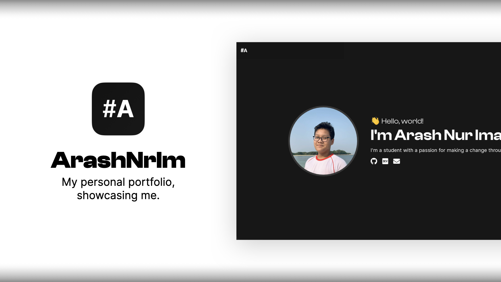

  

# Introduction

Welcome to the project repository of the new and improved version of my portfolio! Unlike the previous iteration, this project was built from the ground up without the use of a boilerplate template. With the help of [Gatsby](https://gatsbyjs.com), [Vercel](https://vercel.com), and [Tailwind CSS](https://tailwindcss.com), the portfolio was reborn.

Works are still being done actively in the background to make it better. Should you notice some minor discrepancies like minor bugs and issues, please feel free to create an Issue.

# Contributing

Since this project is mostly a personal project to showcase myself, it is unlikely that external assistance is required for this project. Either way, though, if you would like to offer some assistance — offering tips, for example — the Issues page is always open.
